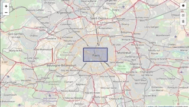

# Terra Draw Map

Component created with React, Leaflet, Leaflet Draw, and turfjs.

Display a map with props layer.

And get info layer who intercept our drawing or on click.



## How to use ?

````
  import TerraDrawMap from 'TerraDrawMap';
  
  ...

  <TerraDrawMap
    config={{ layers: [polygon] }}
    maxBounds={[[48.815575, 2.224122], [48.902157, 2.46976]]}
    center={[48.856840, 2.351239]}
    zoom={11}
    getDataOnClick={data => this.getDataOnClick(data)}
    getDataOnDraw={data => this.getDataDraw(data)}
  />

````

Config variable= { layers: [Array on layer] }

Layer = {
    id: 'id of layer',
    display: boolean,
    type: 'fill' or 'line'
    geometry: {
        type: 'supported types: Polygon, MultiPolygon, LineString, MultilineString',
        coordinates: [coordinates]
    },
    paint: () => {
        'function to handle color ... of layer'
    }
}

For more : Look for the example inside tests folder.

### getDataOnClick
  Get data when the user click on layer

    Return {'id of layer' : {properties}}

### getDataOnDraw 
  Get data layer under the drawing

    Return [{'id of layer' : {properties}}]

## Stories folder

Contain all stories for this component

## Tests folder

Contain example app (created with create react app) with tests

## Src folder

Contain the src component
